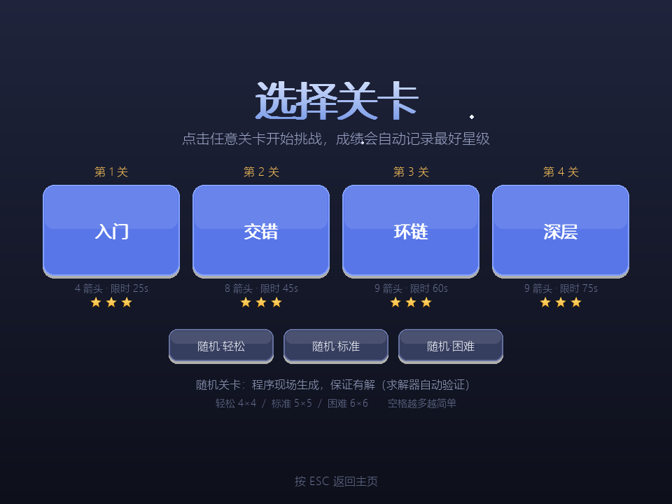
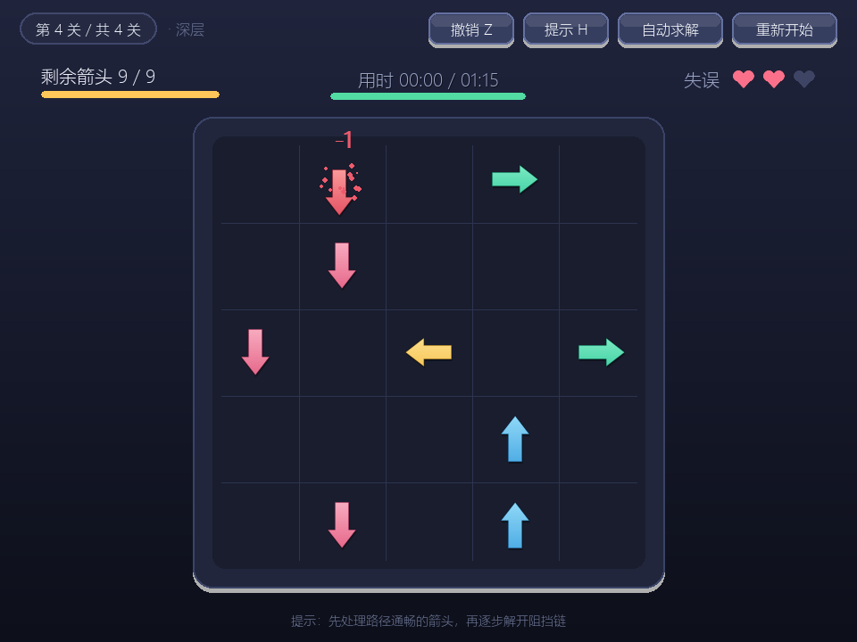
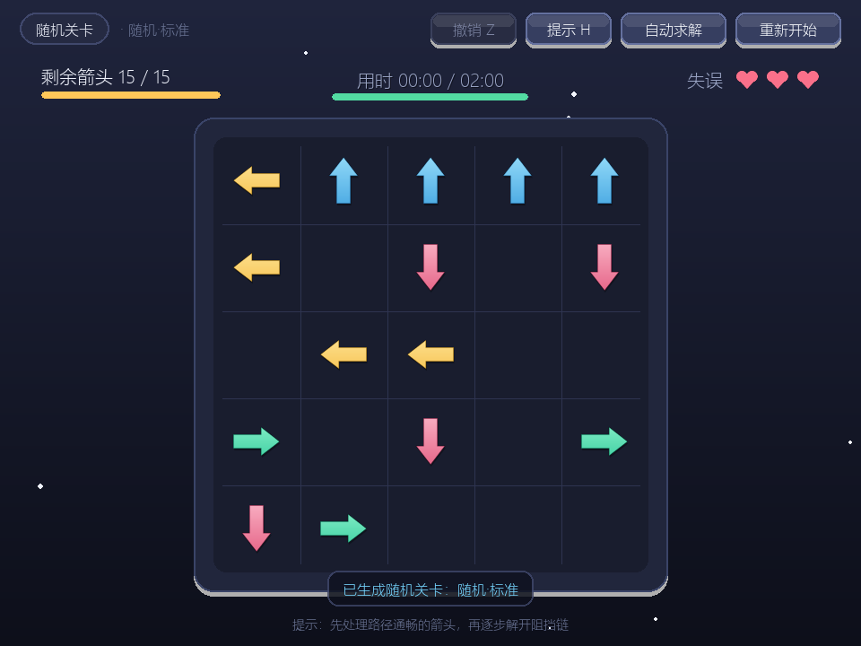

# 一箭又一箭

点击式箭头解谜小游戏。棋盘上散布着上、下、左、右四个方向的箭头，玩家观察箭头之间的
阻挡关系，按正确顺序点击，让所有箭头依次飞出棋盘。

项目用 Python + Pygame 开发，采用 AIGC 工具辅助完成，核心逻辑与界面完全分离，
并有单元测试和无头整局冒烟测试保证可运行。

## 项目简介

- 点一个箭头：如果它到棋盘边界之间没有别的箭头挡路，箭头就飞出棋盘并消失；
- 如果前方被挡：箭头晃动变红、朝自己的方向“顶”一下，失误次数 -1；
- 清空全部箭头即过关；失误次数耗尽或倒计时走完则本关失败。

## 开发环境

| 项目 | 版本 |
|---|---|
| Python | 3.9 及以上（开发验证于 3.12.10） |
| pygame | 2.1 及以上（开发验证于 2.6.1） |
| 操作系统 | Windows / macOS / Linux |

## 安装与运行

```bash
pip install -r requirements.txt
python main.py
```

### 运行测试

```bash
# 规则与路径检测的单元测试（73 条，不需要 pygame 窗口）
python -m unittest test_logic.py test_gameplay.py -v

# 无头整局冒烟测试：真的把 4 个关卡和扩展功能跑一遍
python self_test.py
```

### 重新生成截图

```bash
python make_screenshots.py
```

## 游戏操作说明

| 操作 | 说明 |
|---|---|
| 鼠标左键点击箭头 | 路径通畅则飞出；有阻挡则晃动变红，失误 -1 |
| 点击「重新开始」/ 按 R 键 | 当前关卡恢复到初始状态 |
| 按 H 键 / 点击「提示」 | 求解器算出当前局面的解法，呼吸光圈高亮下一步该点的箭头 |
| 按 Z 键 / 点击「撤销」 | 撤销上一步：飞出的箭头回到原位，误点的失误次数恢复 |
| 按 A 键 / 点击「自动求解」 | AI 按求解器给出的顺序自动点击通关，可随时「停止求解」接管 |
| 按 ESC 键 | 返回开始界面（开始界面下退出程序） |

## 游戏规则

1. 箭头只有上、下、左、右四个方向。
2. 点击箭头时，检查它到棋盘边界之间是否存在其他箭头。
3. 没有阻挡：箭头飞出棋盘并消失。
4. 有阻挡：箭头晃动变红并显示「-1」，失误次数减一。
5. 清空全部箭头通关，失误次数耗尽则失败。
6. 每关有时间限制，倒计时结束前未清空全部箭头则失败。

## 关卡

| 关卡 | 棋盘 | 箭头数 | 失误次数 | 目标用时 |
|---|---|---|---|---|
| 第 1 关 入门 | 3×3 | 4 | 3 | 25s |
| 第 2 关 交错 | 4×4 | 8 | 3 | 45s |
| 第 3 关 环链 | 5×5 | 9 | 4 | 60s |
| 第 4 关 深层 | 5×5 | 9 | 3 | 75s |

全部关卡使用 `logic.solve_level` 自动验证存在通关顺序（见 `test_logic.py`）。

关卡设计注意点：**不要在同一行/同一列放两个正面对撞的箭头**（例如 `R.L`），
它们会互相挡住，形成无解死锁。`logic.validate_level()` 会在开发期直接把这种关卡报出来。

## 项目结构

```
main.py             程序入口
game.py             界面层：状态机、交互、渲染、动画
logic.py            核心逻辑：路径检测、求解器、GameState 状态机、随机关卡生成
levels.py           关卡数据（4 个手工设计关卡）
theme.py            颜色 / 尺寸 / 手感参数
graphics.py         渐变、箭头、心形、星形、按钮等绘制工具
effects.py          粒子与飘字
test_logic.py       路径检测、关卡可解性、随机关卡生成、星级评价的单元测试
test_gameplay.py    T01~T06 六个必测项的自动化测试（不需要 pygame 窗口）
self_test.py        无头整局冒烟测试：真的把游戏跑一遍
make_screenshots.py 无头导出界面截图到 screenshots/
```

### 分层说明

```
GameState（logic.py）   纯数据规则：点击判定、失误、胜负、撤销、重开
      ↑ 界面只调用它、不自己实现规则
Game（game.py）         界面层：把状态画出来、放动画、收鼠标键盘事件
```

这样分层的好处是：`logic.py` 完全不 import pygame，所有规则都能在没有窗口的情况下
用单元测试覆盖；界面出问题时可以确定逻辑是对的，反之亦然。

## 实现要点

### 路径检测

方向统一映射成位移向量，四个方向共用一段循环，边界判断写在 `while` 条件里，
越界自然退出，从根上避免数组越界：

```python
DIRS = {'U': (-1, 0), 'D': (1, 0), 'L': (0, -1), 'R': (0, 1)}

def is_blocked(grid, row, col, direction):
    dr, dc = DIRS[direction]
    r, c = row + dr, col + dc
    while 0 <= r < len(grid) and 0 <= c < len(grid[0]):
        if grid[r][c] is not None:
            return True          # 路上有箭头 → 被挡
        r += dr
        c += dc
    return False                 # 一路到边界都没东西 → 可以飞出
```

### 逻辑与表现分离

点中一个可飞出的箭头时，**立刻把棋盘格子置空**（逻辑立即生效），
同时新建一个 `FlyingArrow` 对象负责“飞出去”的动画；通关判定要等所有飞行动画
播完才弹结算，避免“箭头还在飞就已经显示通关”。

碰撞反馈同理：点击时失误立刻扣掉，画面上的箭头则变红、朝自己的方向顶出去再弹回来
（用剩余反馈时间当进度：前半段冲出去、后半段退回来），同时爆粒子、飘 `-1`。

### 求解器：一个算法撑起三个功能

`solve_level()` 是带记忆化的深度优先搜索，返回一串合法点击顺序，被三处复用：

1. **验关卡**：`validate_level()` / `validate_levels()` 确认每关真的有解；
2. **提示**：取解法的第一步高亮；
3. **自动求解**：按固定节奏逐步播放解法。

用 DFS 而不是 BFS：这个游戏每点一次必定消掉一个箭头，所以只要搜到空棋盘，
路径长度就一定等于箭头数，任何一条合法路径都是不浪费点击的解法，不需要按最短路径
遍历所有局面。实测同一个 6×6、29 个箭头的密集棋盘，DFS 约 0.1ms，
而 BFS 要展开几十万个中间状态、耗时 40 秒以上——提示功能每点一次都要重算解法，
这个差距直接决定界面会不会卡住。

`solve_level()` 用 `max_states` 兜底，防止关卡设计出错（例如大棋盘死锁）时把界面卡死。

## 星级评价规则

| 条件 | 星级 |
|---|---|
| 0 次失误 | 3 星 |
| 失误数 ≤ 总失误数的一半 | 2 星 |
| 其他 | 1 星 |

调整项：

- 用时超过关卡目标时间（par_time）：-1 星
- 使用过提示：最高 2 星
- 使用过自动求解：最高 1 星
- 下限 1 星

星级计算在 `logic.compute_stars()` 中，是纯函数，有单元测试覆盖。

## 扩展功能说明

| 功能 | 说明 |
|---|---|
| 提示（H） | 复用 `solve_level()` 对当前局面求解，取第一步呼吸高亮；棋盘一变缓存自动失效 |
| 撤销（Z） | `GameState.history` 记录 `clear` / `block` 两类操作，撤销时还原箭头、剩余数、失误次数 |
| 自动求解（A） | 每 `AUTO_STEP_DELAY` 秒重新求解当前局面并走一步，复用 `try_clear()`，动画与手动点击一致 |
| 星级评价 | 按失误数、用时、是否用过提示/自动求解给 1~3 星 |
| 进度存档 | 每关最好星级写入 `savegame.json`，选关界面用星星显示；存档损坏不影响运行 |
| 随机关卡 | 三个难度档位，程序现场生成并保证有解，见下 |
| 时间限制 | 可视化倒计时条，快超时变红，时间用尽判失败 |

### 随机关卡是怎么保证“一定有解”的

不是“随机生成再碰运气”，而是**逆序构造**：从空棋盘开始一个一个往上放箭头，
每次只允许把箭头放在「此刻就能直接飞出」的格子（`directions_for_cell()` 判定）。
把放置顺序倒过来就是一份合法通关顺序——放上去时能飞出，说明轮到它飞的时候，
挡在它前面的箭头早都清掉了。

所以任意一份按这个规则造出来的布局都**不可能死锁**。生成完还会再交给
`solve_level()` 独立复验一次，构造逻辑和求解器互为验证（`test_logic.py`
里的 `TestRandomLevelGenerator` 就是这么测的）。难度用箭头占格子的比例控制：
摆得越满，能放的位置越少、阻挡链越长。

## 游戏截图

开始界面：


选关界面（含每关最好星级与随机关卡入口）：



游戏进行中（HUD 显示关卡、剩余箭头、倒计时、失误次数；呼吸光圈是“提示”高亮）：


碰撞反馈：箭头变红、朝自己的方向顶出去、飘出 `-1`，失误次数 -1：



通关界面（星级评价 + 结算数据）：


失败界面（失败原因区分“失误耗尽”与“超时”）：


随机关卡（求解器验证有解）：



### 作者上传的截图（GitHub 附件）

以下为作者本人在 GitHub 网页端上传的截图附件，保留于此以便在 GitHub 页面上直接显示：

-开始页面


-关卡选择


-游戏进行


-游戏通关


-游戏失败


> 说明：早期的纯文字版 README 是在 GitHub 网页端编辑的，本文件为完整版，
> 已把网页端上传的截图附件一并保留；仓库内的 `screenshots/` 目录同时提供了
> 由 `make_screenshots.py` 直接导出的 PNG，两种方式都能正常显示。

## 素材说明

本项目所有图形（箭头、心形、星形、按钮、粒子、渐变背景）均由 Pygame 代码实时绘制，
未使用任何外部图片、音效素材。
