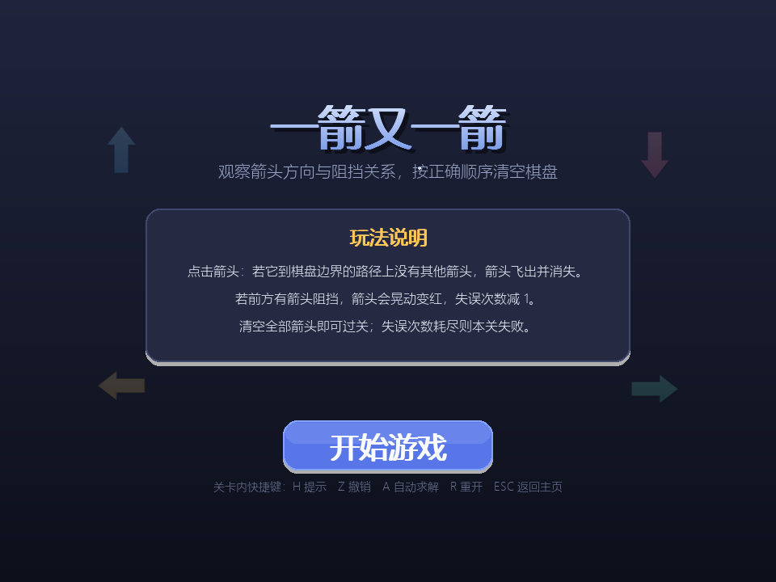
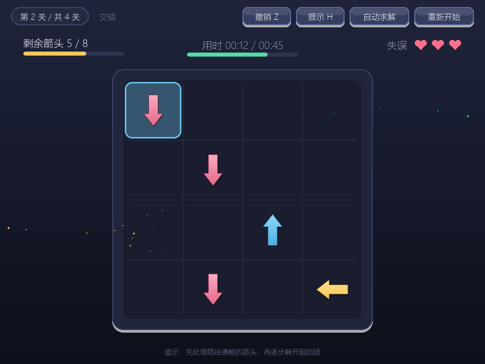
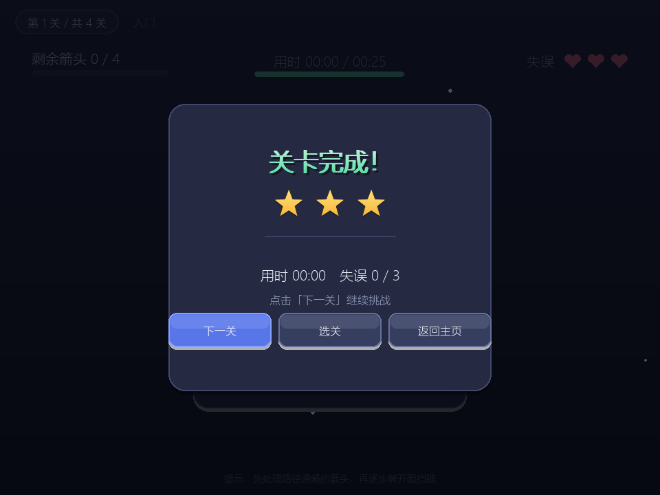
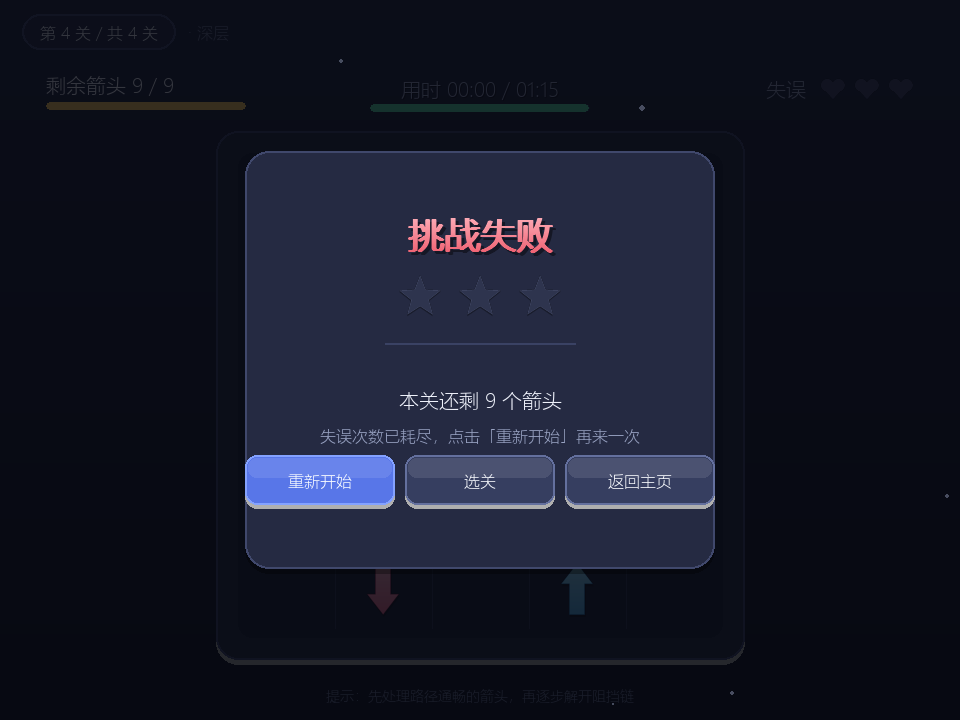

# 一箭又一箭

## 项目简介
使用 Python + Pygame 实现的点击式箭头解谜小游戏。玩家需要观察箭头方向与相互阻挡关系，
按正确顺序点击箭头，使全部箭头飞出棋盘。项目使用 AIGC 工具辅助开发，代码经过实际运行与测试。

## 开发环境
- Python 3.9 及以上
- pygame 2.1 及以上
- 操作系统：Windows / macOS / Linux

## 安装与运行
```bash
pip install -r requirements.txt
python main.py
```

运行单元测试：
```bash
python -m unittest test_logic.py -v
```

## 游戏操作说明
| 操作 | 说明 |
|---|---|
| 鼠标左键点击箭头 | 路径通畅则飞出；有阻挡则晃动变红，失误 -1 |
| 点击「重新开始」/ 按 R 键 | 当前关卡恢复到初始状态 |
| 按 H 键 / 点击「提示」 | 求解器算出当前局面的最优解，呼吸光圈高亮下一步该点的箭头 |
| 按 Z 键 / 点击「撤销」 | 撤销上一步：飞出的箭头回到原位，误点的失误次数恢复 |
| 按 A 键 / 点击「自动求解」 | AI 按求解器给出的顺序自动点击通关，可随时「停止求解」接管 |
| 按 ESC 键 | 返回开始界面（开始界面下退出程序） |

## 游戏规则
1. 箭头只有上、下、左、右四个方向。
2. 点击箭头时，检查它到棋盘边界之间是否存在其他箭头。
3. 没有阻挡：箭头飞出棋盘并消失。
4. 有阻挡：箭头晃动变红并显示「-1」，失误次数减一。
5. 清空全部箭头通关，失误次数耗尽则失败。
6. 每关有时间限制，倒计时结束前未清空全部箭头则失败。

## 关卡
| 关卡 | 棋盘 | 箭头数 | 失误次数 | 目标用时 |
|---|---|---|---|---|
| 第 1 关 入门 | 3×3 | 4 | 3 | 25s |
| 第 2 关 交错 | 4×4 | 8 | 3 | 45s |
| 第 3 关 环链 | 5×5 | 9 | 4 | 60s |
| 第 4 关 深层 | 5×5 | 9 | 3 | 75s |

全部关卡使用 `logic.solve_level` 自动验证存在通关顺序（见 `test_logic.py`）。

## 星级评价规则
| 条件 | 星级 |
|---|---|
| 0 次失误 | 3 星 |
| 失误数 ≤ 总失误数的一半 | 2 星 |
| 其他 | 1 星 |

调整项：
- 用时超过关卡目标时间（par_time）：-1 星
- 使用过提示：最高 2 星
- 使用过自动求解：最高 1 星
- 下限 1 星

星级计算在 `logic.compute_stars()` 中，是纯函数，有 7 条单元测试覆盖。

## 扩展功能说明
- **提示**：复用 `solve_level()` 对当前局面求解，取第一步高亮。
  （棋盘每变一次就失效缓存，保证提示始终对应真实局面。）
- **自动求解**：同一份解法，按 `AUTO_STEP_DELAY` 定时逐步执行，
  复用正常的 `try_clear()` 路径，因此动画、粒子和手动点击完全一致。
- **撤销**：`history` 记录 `{"kind": "clear"/"block", ...}`，
  撤销时还原箭头、剩余箭头数、失误次数，并让解法缓存失效。
- **星级评价**：见上表。

## 项目结构
```
main.py         程序入口
game.py         状态机、交互与渲染
logic.py        路径检测与求解器（纯逻辑，可单测）
levels.py       关卡数据
theme.py        颜色 / 尺寸 / 手感参数
graphics.py     渐变、箭头、心形、按钮等绘制工具
effects.py      粒子与飘字
test_logic.py   单元测试
```

## 实现要点
- 棋盘用二维列表表示，`None` 表示空位。
- 方向统一映射为 (dr, dc) 向量，路径检测用统一的循环，天然处理边界。
- 箭头使用 4 倍超采样渲染 + `smoothscale` 降采样，得到平滑边缘。
- 逻辑与表现分离：点击成功时立即从棋盘移除，飞出动画由独立对象负责。

## 游戏截图





## 素材说明
本项目所有图形均由 Pygame 代码绘制，未使用任何外部图片、音效素材。
