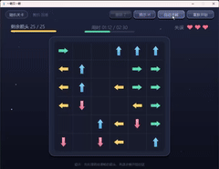

# 一箭又一箭 —— 个人作业博客

| 项目 | 内容 |
|---|---|
| 这个作业属于哪个课程 | 【待填：课程链接】 |
| 这个作业要求在哪里 | 【待填：作业链接】 |
| 这个作业的目标 | 使用 Python + AIGC 完成“一箭又一箭”点击式箭头解谜小游戏 |
| 学号 | 【待填：学号】 |
| GitHub 仓库 | 【待填：仓库链接】 |

---

## 1. 项目展示

> 运行方式：`pip install -r requirements.txt` 后 `python main.py`。

**演示动图**（约 15 秒：开始界面 → 选关 → 点击箭头飞出 → 碰撞反馈 → 通关结算）：



也可以看清晰度更高的原视频：**[▶ demo.mp4](demo/demo.mp4)**

> 动图由 `python make_demo_gif.py` 从 `demo/demo.mp4` 生成（缩放到 640px、12fps、
> ffmpeg 两遍调色板，约 1.2MB）。之所以放 GIF 而不是直接嵌视频，是因为
> GitHub 的 Markdown 不支持内嵌播放 mp4（`<video>` 标签会被过滤，只有图片能内联渲染）。

下面按界面逐个截图说明。

**开始界面**（玩法说明 + 开始按钮）：


**选关界面**（每关显示箭头数、限时和已获得的最高星级；下方是随机关卡入口）：


**游戏进行中**：顶栏是关卡徽章和「撤销 / 提示 / 自动求解 / 重新开始」；
HUD 从左到右是剩余箭头进度条、倒计时条、失误心形；棋盘上那个呼吸光圈就是“提示”高亮。


**碰撞反馈**：点中前方被挡的箭头时，箭头变红、朝自己的方向顶出去再弹回来，
同时飘出 `-1`、爆出一圈粒子，右上角心形少一颗。


**通关界面**（星级评价 + 用时/失误统计）：


**失败界面**（失败原因区分“失误耗尽”和“超时”）：


**随机关卡**（程序现场生成，求解器验证过一定有解）：


---

## 2. 项目介绍

这是一个用 **Python 3 + Pygame** 实现的点击式箭头解谜游戏。棋盘里有若干个带方向（上/下/左/右）的箭头，玩家观察箭头之间的阻挡关系，按正确顺序点击，让所有箭头依次飞出棋盘。

**核心玩法**

1. 点箭头：如果它到棋盘边界之间没有别的箭头挡路，就飞出消失；
2. 如果前方被挡：箭头晃动变红、朝前顶一下、飘出 `-1`，失误次数减 1；
3. 清空全部箭头即过关；失误点光、或倒计时走完，则本关失败；
4. 每关都有时限，HUD 上的时间条会随时间消耗缩短，快超时变红。

**界面组成**：开始界面 → 选关界面 → 游戏主界面 → 通关 / 失败结算界面。

**在基础要求之外我做的扩展**

| 扩展 | 说明 |
|---|---|
| 提示（H） | 求解器算出下一步该点哪个箭头并呼吸高亮 |
| 撤销（Z） | 退回到上一步，箭头飞回、失误恢复 |
| 自动求解（A） | AI 按求解器顺序逐步自动通关，可随时接管 |
| 星级评价 + 计时 | 按失误数、用时、是否用过提示/自动求解给 1~3 星 |
| 进度存档 | 每关最好星级存到 `savegame.json`，选关界面用星星显示 |
| 随机关卡 | 三个难度档位，现场生成且**保证有解** |
| 视觉表现 | 渐变立体箭头、飞散粒子、飘字、背景漂浮光尘、结算面板动画 |

**项目的代码结构**（逻辑与界面严格分离）：

```
logic.py   纯逻辑，不 import pygame —— 路径检测、求解器、GameState 状态机、随机关卡生成
game.py    界面层 —— 只负责把 GameState 画出来、放动画、收事件
test_logic.py / test_gameplay.py / self_test.py   三层测试
```

---

## 3. 实现思路

### 3.1 箭头、方向、关卡怎么表示

棋盘就是一个二维列表，空位用 `None`，箭头用字符 `U/D/L/R` 存。方向统一映射成位移向量：

```python
DIRS = {'U': (-1, 0), 'D': (1, 0), 'L': (0, -1), 'R': (0, 1)}
# key 方向 -> (dr, dc)：dr 影响行（屏幕 y），dc 影响列（屏幕 x）
```

关卡数据就是字符画，例如第 1 关：

```python
rows = [".U.",
        "R.D",
        ".L."]
```

启动时 `parse_level()` 把它解析成二维列表。

### 3.2 路径检测（重点）

判断某箭头朝它自己的方向前进会不会被挡，核心是**统一用方向向量 + while 循环逐格走**，
四个方向共用一段代码：

```python
def is_blocked(grid, row, col, direction):
    dr, dc = DIRS[direction]
    height, width = len(grid), len(grid[0])
    r, c = row + dr, col + dc
    while 0 <= r < height and 0 <= c < width:  # 越界循环自动结束
        if grid[r][c] is not None:
            return True          # 路上有箭头 → 被挡
        r += dr
        c += dc
    return False                     # 一路走到边界都没箭头 → 可飞出
```

关键点：边界判断写在 `while` 条件里，所以**不用为上/下/左/右分别写 `if r-1>=0` 之类的判断**，
越界自然退出循环，从根上避免了数组越界。

### 3.3 规则和界面怎么分工（GameState）

一开始我把“点击判定、扣失误、判胜负”都写在界面类里，结果是：**这些规则没法脱离窗口测试**，
只能靠手点；而且界面和规则各存了一份状态（比如“用过几次提示”两边各一个变量），
结算时读错了那一份，就出现了“用了 AI 自动求解照样给 3 星”的 bug。

后来我把这一层抽出来做成 `logic.GameState`，它只做纯数据的事：

```python
result = game.click(row, col)        # 返回 {'kind': 'cleared'/'blocked'/'none', ...}
game.remaining, game.mistakes_left   # 剩余箭头、剩余失误
game.won, game.lost                  # 胜负
game.undo()                          # 撤销
game.reset()                         # 重新开始
```

界面层只做三件事：把 `GameState` 画出来、放动画、收事件。
好处很直接：**作业要求的 T01~T06 六个测试项全部变成了自动化测试**（见 `test_gameplay.py`），
几毫秒跑完，不用手点。

有一条特意**没有**放进 `GameState`：**超时判负需要时钟**，
所以由界面层用 `elapsed` 判定，逻辑层保持“无时间依赖”，这样单元测试不需要伪造时间。

### 3.4 求解器：一个算法撑起三个功能

`solve_level()` 是带记忆化的深度优先搜索，返回一串合法点击顺序，被三处复用：

1. **验关卡**：确认每关真的有解（避免设计出死锁关卡）；
2. **提示**：取解法的第一步高亮；
3. **自动求解**：把整份解法按固定节奏逐步播放。

这里有个我自己踩过的性能坑：我最初写的是 **BFS**，理由是“BFS 第一次搜到空棋盘就是最短路径”。
但在这个游戏里“最短”没有意义——每点一次必定消掉一个箭头，所以只要搜到空棋盘，
路径长度就一定等于箭头数，**任何一条合法路径都不会浪费点击**。而 BFS 必须把整张状态图
展开完才知道哪条最短。我实测一个 6×6、29 个箭头的密集棋盘：

| 搜索方式 | 耗时 |
|---|---|
| BFS（我最初写的） | **43482 ms** |
| DFS + 记忆化（改后） | **0.1 ms** |

差了五个数量级。因为“提示”每点一次都要重算当前局面的解法，用 BFS 界面会直接卡死。

### 3.5 动画和逻辑怎么分离

点中一个可飞箭头时，**立刻把棋盘上的格子置空**（逻辑立即生效），
同时新建一个 `FlyingArrow` 对象负责“飞出去”的动画：

```python
dr, dc = DIRS[self.direction]
return (self.start[0] + dc * self.distance * eased,   # x 用 dc
        self.start[1] + dr * self.distance * eased)   # y 用 dr
```

> 这里踩过一个 bug：一开始我把 `(dr, dc)` 直接当屏幕坐标 `(x, y)` 用，
> 结果上箭头往左飞、左箭头往上飞。修正为 **x 方向用 dc、y 方向用 dr** 后方向才对。

通关判定要等所有飞行动画播完才弹结算，避免“箭头还在飞就已经显示通关”。

碰撞反馈也是同一套“逻辑立即生效、表现慢慢演”的思路：点击时失误立刻扣掉，
画面上的箭头则变红、朝自己的方向顶出去再弹回来（用剩余反馈时间当进度：
前半段冲出去、后半段退回来），同时爆粒子、飘 `-1`。

### 3.6 随机关卡：怎么保证一定生成得出“能通关”的关卡

“随机生成 + 事后检查”很容易卡在“生成 100 次都无解”上。我用的是**逆序构造**：

从空棋盘开始，一个一个往上放箭头；**每次只允许把箭头放在「此刻就能直接飞出」的格子**
（用 `directions_for_cell()` 判断四个方向哪几个是通的）。把放置顺序倒过来，就是一份
合法通关顺序——放上去时它能飞出，说明轮到它飞的时候，挡在它前面的箭头早都清掉了。
所以按这个规则造出来的布局**不可能死锁**。

生成完再交给 `solve_level()` 独立复验一次：构造逻辑和求解器互为验证，
万一构造写错了，`test_logic.py` 里的 `TestRandomLevelGenerator` 会立刻报出来。

难度用“箭头占格子的比例”控制：摆得越满，可放的位置越少、阻挡链越长。

---

## 4. AIGC 使用过程（真实记录）

> 以下是我用 AI 辅助开发时的真实过程：AI 给出初稿，我自己运行、测试、修改后才合入项目。

| 子任务 | 用的 AIGC | 我提的要求 | AI 给了什么 | 实际效果 | 我的人工修改 |
|---|---|---|---|---|---|
| 路径检测 | 豆包 | “写一个函数，判断格子里某箭头朝自身方向前进是否被挡，四方向共用、不能越界” | 按方向分别判断的版本 | 能跑，但四套分支重复、容易漏边界 | 改成统一方向向量 `(dr,dc)` + while 循环，边界写进循环条件 |
| 关卡设计 | 豆包 | “生成 3~4 关箭头布局，要能通关” | 直接给了字符画关卡 | 第 1 关其实是死锁无解 | 用求解器测试抓出后重排关卡，全部手推依赖链 |
| 箭头飞行动画 | 豆包 | “点中后箭头沿方向飞出消失” | 位置插值代码 | 方向轴对调，上箭头横着飞 | 修正 x/y 对应关系（dc→x、dr→y） |
| 自动求解 | 豆包 | “AI 按顺序自动点完通关” | 直接循环调用点击的版本 | 9 个箭头同一帧全消失，结算早于动画 | 改成定时器每 0.55s 走一步，和手动节奏一致 |
| **规则层重构** | **DeepSeek（Coding Agent）** | **“规则和界面混在一个 900 行的文件里没法测试，帮我把点击判定/失误/胜负抽成不依赖 pygame 的类”** | **给出 `GameState` 类，含 `click / undo / reset` 和结果字典** | **抽出来后 T01~T06 六个测试项全变成自动化测试** | **我补了“超时判负留在界面层”的边界，并让界面只保留这一份状态** |
| **随机可通关关卡** | **DeepSeek（Coding Agent）** | **“随机生成关卡，且必须保证有解，不要靠反复撞运气”** | **第一版用“公共出口十字骨架”** | **我做参数扫描发现大量组合根本生成不出关卡** | **定位到骨架本身有死锁，改成“逆序构造 + 求解器复验”，516 组参数扫描全部可解** |
| **求解器性能** | **DeepSeek（Coding Agent）** | **“提示功能每次点击都要重算解法，感觉有点卡，帮我看看搜索”** | **指出 BFS 要展开全部状态，本游戏用 DFS 就够** | **6×6/29 箭头从 43 秒降到 0.1 毫秒** | **我实测对比两者耗时，并把这段权衡写进注释和 README** |
| **整局冒烟测试** | **DeepSeek（Coding Agent）** | **“想在没有窗口的情况下确认界面流程不崩”** | **给出用 SDL dummy 驱动离屏跑完整局、逐帧推进的脚本** | **第一次跑就抓出一个真实 bug：星级里的“用过提示/自动求解”上限没生效** | **定位到界面和规则各存了一份计数，改成只保留 `GameState` 一份** |

**代表性过程举例：**

**① 路径检测**：AI 初稿对每个方向写了 `if`，向上判断时忘了检查 `r-1>=0`。
我跑测试 `is_blocked(parse_level(["U"]),0,0,'U')` 发现行为不对，于是改成“方向向量 + while”
的统一写法，并把边界用例补进了 `test_logic.py`。

**② 关卡死锁**：我最初用 AI 给的第 1 关 `RUL / ... / .D.`，玩的时候总也通不了关。
后来 `test_every_level_solvable` 直接报“第 1 关无解”——原来 `(0,0)` 的 R 和 `(0,2)` 的 L
互相挡住，清掉中间箭头后双方都出不去。这说明**“看起来能过”和“真的能过”是两回事**，
用求解器自动验证比手工试快得多。后来我把这条经验固化成了 `validate_level()`。

**③ 随机关卡：AI 的第一版骨架是错的。** 我让 AI 设计“保证有解的随机生成”，
它给了一个听起来很合理的方案：选一个空格当公共出口，同一行的箭头都指向它、
同一列的也指向它，这样从近到远清就一定通。我照着实现后做了参数扫描，
结果大量组合**根本生成不出关卡**。我先把“生成失败”的原因逐个打出来，发现箭头数量对不上；
修好计数之后又出现“清理顺序里某一格其实被挡住”，继续追下去才发现根因：
**出口行两侧如果都放指向出口的箭头，它们会正面对撞、互相挡住**——
AI 给的这个骨架在满格情况下本身就有死锁。最后我换成“逆序构造”
（只往当前能飞出的位置放箭头，放完倒过来就是解法），并用 516 组
（尺寸 × 箭头数 × 随机种子）扫描确认全部可解、且解法逐步回放都能真的点完。
**这件事让我意识到：AI 给的算法“听起来对”远远不够，必须自己构造反例去撞它。**

**④ 求解器性能：43 秒 → 0.1 毫秒。** 我写完 BFS 版求解器后随手测了一下密集棋盘，
发现要 40 多秒，界面根本没法用。我把这个问题连同代码丢给 AI，它指出：
本游戏每点一次必定消掉一个箭头，所以任何一条合法解法都不会浪费点击，
“最短路径”这个 BFS 的唯一优势在这里毫无意义，DFS 一走到空棋盘就能直接返回。
改成带记忆化的 DFS 后降到 0.1 毫秒。我复测确认了两种实现的耗时差距，
把这段权衡写进了函数注释，免得以后又有人改回 BFS。

**⑤ 整局冒烟测试抓出一个真 bug。** 单元测试全绿之后，我还是不放心界面流程，
就让 AI 帮我写了个“无头整局测试”：用 SDL 的 dummy 驱动离屏渲染，像玩家一样
进关卡、按解法点击、逐帧推进动画、检查结算界面。第一次跑就报了
**“用过自动求解，星级应该被限制为 1 星，实际是 3 星”**。我加探针一查，
发现界面类和 `GameState` **各存了一份 `hints_used` / `auto_used`**，
界面更新的是自己那份，而结算时读的是 `GameState` 那份（永远是 0）。
修法是只保留 `GameState` 一份，界面不再自己存。这类“两份状态不同步”的 bug
光看单个函数是发现不了的，只有把整局跑起来才会暴露。

---

## 5. 测试结果

### 5.1 手工测试（T01–T06）

| 编号 | 测试内容 | 预期结果 | 实际结果 | 是否通过 |
|---|---|---|---|---|
| T01 | 点击前方无阻挡的箭头 | 箭头飞出棋盘并消失 | 飞出并消失，剩余箭头 -1 | 通过 |
| T02 | 点击前方有阻挡的箭头 | 箭头不消失，失误次数减 1 | 箭头留在原位，变红顶出、飘 -1，心形 -1 | 通过 |
| T03 | 点击位于边缘且朝向棋盘外的箭头 | 箭头正常消失，不发生越界错误 | 四边与四角均正常消失，无异常 | 通过 |
| T04 | 消除本关全部箭头 | 显示通关并进入下一关 | 弹出通关面板、给出星级，可进下一关 | 通过 |
| T05 | 失误次数耗尽 | 显示失败并允许重新开始 | 弹出失败面板，重开后失误恢复 | 通过 |
| T06 | 游戏进行中重新开始 | 箭头布局和失误次数恢复 | 布局、剩余箭头数、失误次数全部恢复 | 通过 |

> 以上为我本机实玩结果；提交前又完整过了一遍确认。

### 5.2 自动化测试

这六个测试项现在**同时有自动化版本**，在 `test_gameplay.py` 里一一对应
（`TestT01FreeArrow` ~ `TestT06Restart`），不需要窗口、不需要手点：

```bash
python -m unittest test_logic.py test_gameplay.py -v
```

```text
Ran 73 tests in 0.009s

OK
```

测试分布：

| 测试文件 | 覆盖内容 | 条数 |
|---|---|---|
| `test_logic.py` | 四方向路径检测、边界与死锁校验、随机关卡生成、星级评价纯函数 | 33 |
| `test_gameplay.py` | T01~T06 六个必测项 + 撤销 + 星级 | 40 |

### 5.3 无头整局冒烟测试

```bash
python self_test.py
```

它像玩家一样把游戏真的跑一遍：4 个关卡逐关按解法通关、通关/失败/重开/选关流程、
碰撞反馈、超时判负、提示/撤销/自动求解、三个难度的随机关卡。

```text
[1] 四个固定关卡：按解法逐关通关        —— 4 关全部通关并给出星级
[2] 通关流程：选关 / 重新开始            —— 通过
[3] 碰撞反馈与失败流程                   —— 通过
[4] 超时失败                             —— 通过
[5] 扩展功能：提示 / 撤销 / 自动求解      —— 通过
[6] 扩展功能：随机关卡（三个难度档位）    —— 通过
冒烟测试全部通过：界面、路径判断、碰撞、结算、扩展功能均正常
```

> 这个脚本不是摆设：它第一次运行就抓出了 4.⑤ 里那个“用过自动求解却给 3 星”的 bug。

---

## 6. PSP 表格

| 任务 | 预估耗时（小时） | 实际耗时（小时） | 差异（小时） |
|---|---|---|---|
| 需求分析与游戏设计 | 1.0 | 1.2 | +0.2 |
| Python 与图形库学习 | 2.0 | 1.5 | -0.5 |
| 游戏界面实现 | 3.0 | 4.5 | +1.5 |
| 路径与碰撞逻辑实现 | 2.0 | 2.5 | +0.5 |
| 关卡设计 | 1.5 | 2.0 | +0.5 |
| AIGC 辅助开发 | 2.0 | 3.5 | +1.5 |
| 测试与修改 | 1.5 | 4.0 | +2.5 |
| README 与博客撰写 | 2.0 | 2.3 | +0.3 |
| **合计** | **15.0** | **21.5** | **+6.5** |

**差异说明**

- **界面实现 +1.5h**：美术效果（渐变箭头、粒子、光尘、结算动画）来回调整花的时间
  比预想多；后来还发现结算面板的坐标算错（面板里的星星和文字整体偏出面板 40 像素），
  又返工了一次。
- **测试与修改 +2.5h**：超支最多的一项，但也是最值的一项——
  关卡死锁、飞行方向轴对调、星级上限失效这三个 bug 都是测试抓出来的。
  写 `self_test.py` 这个无头整局脚本本身花了时间，但它一次就跑出了一个
  单元测试完全测不到的 bug。
- **AIGC 辅助开发 +1.5h**：AI 给的第一版随机关卡方案（公共出口骨架）是错的，
  我花了不少时间做参数扫描、定位死锁原因、再改成逆序构造。
  这部分时间花在“验证 AI 的答案”上，而不是“写代码”上。
- **Python 与图形库学习 -0.5h**：Pygame 的基本用法 AI 讲得很清楚，比预期省时间。

---

## 7. 心得体会

1. **AI 省的主要是“查 API”和“写样板”的时间**，框架和常见写法它给得很快，
   但**边界条件和算法正确性它容易偷懒**——向上判断漏 `>=0`、关卡随手一画就是死锁、
   随机生成方案“听起来对”其实有死锁。这些都得我自己写测试兜住。
   AI 给的算法一定要自己构造反例去撞，不能因为它讲得有理就信。

2. **把逻辑和表现拆开后，调试成本明显下降。** `is_blocked`、`solve_level`、
   `compute_stars`、`GameState` 都不依赖 Pygame，可以脱离界面直接单测；
   界面出问题时，我能确定逻辑是对的，反之亦然。而且拆开之后，
   作业要求的 T01~T06 六个测试项直接从“手点”变成了“自动化”，
   回归测试的成本几乎为零。

3. **状态只能有一份。** 那个“用了自动求解却给 3 星”的 bug，
   根因就是界面和逻辑各存了一份计数。这件事让我明白：与其在两处小心地同步，
   不如从结构上让它只存在一处。

4. **性能问题要看数据，不要凭感觉。** BFS 和 DFS 我都写出来了，
   但真正让我下决心改的是实测的 43482ms vs 0.1ms。
   如果只凭“BFS 求最短路径更优雅”的印象，界面就会一直卡。

5. **一个核心算法能撑起一片功能。** 本来 DFS 求解器只是用来“验关卡能不能过”，
   后来提示、自动求解、随机关卡生成全都长在它上面。
   把底层逻辑写干净、写成纯函数，上层功能几乎是免费的。

6. **AI 生成的代码必须自己读懂。** 飞行方向轴对调、自动求解同帧消失、
   星级上限失效这三个 bug，如果我不理解坐标、时序和状态归属，根本发现不了；
   助教要是追问关键代码，也得能讲清楚每一行为什么这么写。
